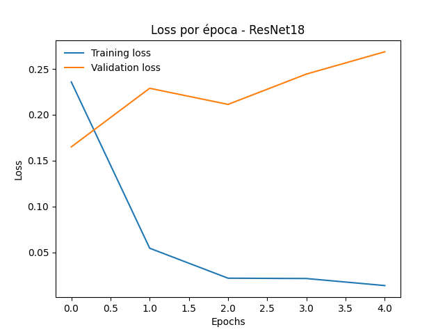

# Clasificador-Perros-Gatos-CNN-Transfer_Learning

## 1. Descripción

Este proyecto implementa modelos de Deep Learning para **clasificar imágenes como perros o gatos**.

El objetivo del proyecto tiene dos enfoques principales:

1. **Optimizar una CNN desde cero**: mejorar progresivamente las métricas del modelo (accuracy, precision, recall, F1-score) manteniendo un bajo nivel de overfitting, usando técnicas como regularización, early stopping y variando la resolución de las imágenes.
2. **Evaluar una red preentrenada (ResNet18)**: aplicar fine-tuning para comparar su rendimiento frente a la CNN desarrollada desde cero.

El **dataset** utilizado es el de [Dogs vs Cats de Kaggle](https://www.kaggle.com/c/dogs-vs-cats/data), que contiene miles de imágenes de perros y gatos recopiladas de internet.

##  2. Estructura del Repositorio

El repositorio está organizado de la siguiente manera:

```
.
├── clasificador_imagenes_perros_gatos_pytorch.ipynb          # Notebook principal con todo el desarrollo, entrenamiento y evaluación de los modelos
├── results/                # Carpeta con gráficos y métricas generadas durante el proyecto
│   ├── Modelo_Profundo_ADAM_32_loss.png
│   ├── resultados_metricass.csv
│   └── ...                 # Otros resultados
├── .gitignore              # Archivos y carpetas ignoradas por Git
├── LICENSE                 # Licencia del proyecto
└── README.md               # Este archivo
```

* **clasificador_imagenes_perros_gatos_pytorch.ipynb**: contiene todo el flujo del proyecto, incluyendo carga de datos, preprocesamiento, definición de modelos, entrenamiento, evaluación y análisis de resultados.
* **results/**: almacena los gráficos de loss, accuracy, comparaciones de modelos y archivos CSV con las métricas de evaluación.
* **.gitignore**: evita que archivos innecesarios (como checkpoints temporales o entornos locales) se suban al repositorio.
* **LICENSE**: licencia elegida para el proyecto.
* **README.md**: explica la descripción, objetivos, estructura y resultados del proyecto.


## 3. Metodología y Desarrollo del Notebook

El flujo de trabajo dentro del notebook sigue un orden modular para facilitar la comprensión y replicabilidad del proyecto:

### 3.1 Funciones Principales

Se definieron funciones para estandarizar y simplificar tareas repetitivas:

* **Carga y Preprocesamiento de Datos**: transforma las imágenes a la resolución deseada (32×32 o 96×96), aplica normalización y división en conjuntos de entrenamiento, validación y prueba.
* **Entrenamiento y Validación**: función general que permite entrenar cualquier modelo y registrar pérdidas por época.
* **Cálculo de Métricas**: evalúa cualquier modelo sobre el conjunto de prueba calculando accuracy, precision, recall, F1-score y matriz de confusión.
* **Guardado de Resultados**: funciones para almacenar gráficos y métricas en la carpeta `results/`.

### 3.2 Evaluación de Modelos

Se siguió un enfoque progresivo:

1. **CNN Profunda con resolución 32×32**:

   * Uso exclusivo del optimizador **Adam**.

2. **CNN Profunda con resolución 96×96**:

   * Se aumentó la resolución para analizar mejoras en métricas.
   * Se seleccionó el mejor optimizador basado en los resultados.

3. **CNN Profunda Regularizada con Early Stopping**:

   * Se introdujeron capas de dropout y early stopping para reducir el sobreajuste observado en las evaluaciones anteriores.
   * Se exploraron distintas tasas de aprendizaje con **Adam**.

4. **CNN Profunda Final**:

   * Modelo optimizado para balancear métricas altas y bajo overfitting.
   * Se utilizó el learning rate que dio mejores resultados en la fase previa.

5. **Modelo Preentrenado ResNet18**:

   * Se aplicó **fine-tuning**, ajustando solo la última capa para clasificación binaria (perro/gato).
   * Se entrenó solo 5 épocas, dado que al ser un modelo preentrenado, converge más rápido.
   * Se compararon sus métricas con las obtenidas por la CNN desarrollada desde cero.


## 4. Resultados y Comparación de Modelos

A continuación se presentan los resultados obtenidos tras evaluar las distintas arquitecturas y configuraciones de entrenamiento:

### 4.1 CNN Profunda 32×32

* **Observaciones**:

  * Se observó un **overfitting evidente**: el loss de entrenamiento disminuye rápidamente mientras que el loss de validación se mantiene más alto.
  * Accuracy final: **78.55%**
* **Gráficos de referencia**: `Modelo_Profundo_ADAM_32_loss.png`
* 

| Métrica             | Valor    |
| ------------------- | -------- |
| Accuracy            | 78.55%   |
| Precisión ponderada | 0.785891 |
| Recall ponderado    | 0.7855   |
| F1 ponderado        | 0.785427 |


### 4.2 CNN Profunda 96×96 (sin regularización)

* **Observaciones**:

  * Se nota un **overfitting todavía más marcado** debido al aumento de resolución y mayor complejidad del modelo.
  * Se mostró un mejor desempeño alcanzando **85.90% de accuracy** al subir la resoluciòn.
* **Gráficos de referencia**: `Modelo_Profundo_Adam_96_loss.png`
* 

| Modelo                            | Accuracy | Precisión ponderada | Recall ponderado | F1 ponderado |
| --------------------------------- | -------- | ------------------- | ---------------- | ------------ |
| model\_profundo\_96\_adam lr=1e-3 | 85.90    | 0.864069            | 0.8590           | 0.858507     |
| model\_profundo\_96\_adam lr=5e-4 | 83.60    | 0.836594            | 0.8360           | 0.835928     |
| model\_profundo\_96\_adam lr=2e-4 | 82.55    | 0.825899            | 0.8255           | 0.825447     |


### 4.3 CNN Profunda 96×96 Regularizada + Early Stopping

* **Observaciones**:

  * La introducción de **regularización** y **early stopping** permitió reducir significativamente el overfitting, aunque persiste de manera controlada.
  * Se observó una ligera disminución de métricas respecto a la versión sin regularización, reflejando un balance entre desempeño y estabilidad.
  * Mejor accuracy alcanzada: **85.60%**
* **Gráficos de referencia**: `Modelo_Profundo_Adam_96 lr=1e-3_loss.png`
* 

| Modelo                            | Accuracy | Precisión ponderada | Recall ponderado | F1 ponderado |
| --------------------------------- | -------- | ------------------- | ---------------- | ------------ |
| model\_profundo\_96\_adam lr=1e-3 | 85.60    | 0.856091            | 0.8560           | 0.855991     |


### 4.4 ResNet18 Preentrenada (Fine-Tuning)

* **Observaciones**:

  * Se aplicó **fine-tuning**: solo se ajustó la última capa para la clasificación binaria, aprovechando los pesos previamente entrenados en ImageNet.
  * Se entrenó solo **5 épocas**, suficiente para adaptar la red sin necesidad de un entrenamiento prolongado.
  * Se observa un **overfitting pronunciado**, probablemente debido a la gran cantidad de parámetros y conocimiento previo del modelo.
  * Accuracy final: **94.15%**, superando ampliamente a la CNN desarrollada desde cero.
* **Gráficos de referencia**: `ResNet18_loss.png`
* 

| Métrica             | Valor    |
| ------------------- | -------- |
| Accuracy            | 94.15%   |
| Precisión ponderada | 0.941553 |
| Recall ponderado    | 0.9415   |
| F1 ponderado        | 0.941498 |


### 4.5 Conclusiones Parciales

1. Incrementar la **resolución de las imágenes** y usar **Adam** mejora significativamente la performance de la CNN.
2. La **regularización y el early stopping** permiten controlar el overfitting, aunque puede haber una ligera caída en métricas.
3. El **ResNet18 preentrenado** ofrece la mejor precisión final, pero con overfitting notable, justificando la necesidad de técnicas de ajuste fino y entrenamiento controlado.
4. El análisis de los gráficos de loss permite visualizar claramente el comportamiento de cada modelo durante el entrenamiento y validar la efectividad de las modificaciones introducidas.


## 5. Conclusión Final y Recomendaciones

El desarrollo y evaluación de los distintos modelos ha demostrado la importancia de seguir un **proceso secuencial y metódico** para mejorar gradualmente el desempeño de una CNN.

* La **CNN profunda inicial** alcanzó un accuracy de \~0,79 con imágenes de 32×32, mostrando un overfitting evidente en los gráficos de pérdida.
* Al aumentar la **resolución a 96×96**, el accuracy subió hasta \~0,86, pero todavía se evidenciaba sobreajuste.
* Con la **regularización y la incorporación de Early Stopping**, el overfitting se redujo notablemente, manteniendo un accuracy cercano al 0,86. Esto resalta la importancia de la **regulación del entrenamiento y control de la complejidad del modelo**.
* El **ResNet18 preentrenado** superó claramente a la CNN construida desde cero, logrando un accuracy de \~0,94, demostrando que el uso de redes preentrenadas es una **opción inmediata y eficiente** para problemas de clasificación de imágenes, especialmente con datasets no homogéneos.

### 5.1 Recomendaciones y futuros experimentos

1. **Optimización del optimizador**: Aunque Adam dio buenos resultados, podría ser interesante experimentar con SGD para verificar si se pueden obtener mejoras adicionales en accuracy y estabilidad.
2. **Estándarización del dataset**: El dataset de Kaggle contiene imágenes variadas de perros y gatos sin control de iluminación, ángulo o calidad. Para futuros trabajos, se recomienda un dataset más **homogéneo y estandarizado**, lo que podría mejorar la generalización y reducir el overfitting.
3. **Aumento de datos (Data Augmentation)**: Aplicar técnicas adicionales como rotaciones, zoom, recortes o cambios de color podría ayudar a mejorar la robustez del modelo.
4. **Transfer learning y fine-tuning**: Usar modelos preentrenados como ResNet, EfficientNet o DenseNet sigue siendo la mejor estrategia para alcanzar métricas altas rápidamente, especialmente en datasets limitados.
5. **Documentación del proceso**: Mantener un registro detallado de los pasos, cambios de hiperparámetros y resultados es crucial para replicar mejoras y justificar decisiones.

En resumen, el proyecto muestra cómo **el entrenamiento secuencial, la regularización y el control del overfitting** permiten mejorar progresivamente un modelo CNN desde cero, mientras que las redes preentrenadas ofrecen resultados superiores y eficientes. Los futuros experimentos deberían explorar optimizadores alternativos, datasets más estandarizados y técnicas avanzadas de aumento de datos para continuar mejorando la performance.

